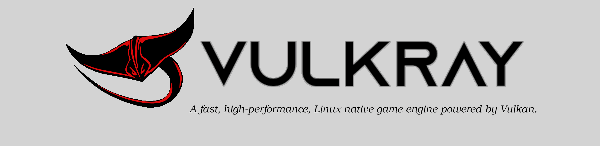

|license| |platforms| |ci| |last_commit| |discord|

Vulkray Engine
##############
A work in progress, high-performance, lightweight Linux native 3D game engine powered by the Vulkan graphics API.

Getting Started
###############

Installing the Conan C/C++ package manager on a **Unix-like** system:

.. code-block:: shell-session

    $ python -m pip install conan
    
Installing the Ninja build system tool on a **Linux** system (package manager may vary by distribution):

.. code-block:: shell-session

    $ sudo pacman -S ninja

Configure the CMake build directory using Conan via the **bash** script:

.. code-block:: shell-session

    $ ./linux/configure.sh release

Compiling the project source via the **bash** script:

.. code-block:: shell-session

    $ ./linux/build.sh release
    
Contributing
############
Please read the `contributor guidelines <./CONTRIBUTING.rst>`_ before submitting your first pull request to the engine source code.

Any contributions, big or small, are encouraged and greatly appreciated. :)

Security Policy
###############
Please read the `security policy <./SECURITY.md>`_ document before reporting a software vulnerability.

Contact
#######
If you have any questions regards to the open source project, feel free to contact us via email at `info@vulkray.com <mailto:info@vulkray.com>`_.

.. |license| image:: https://img.shields.io/github/license/Max-Rodriguez/Vulkray
    :target: https://github.com/Max-Rodriguez/Vulkray/blob/master/COPYING
    
.. |ci| image:: https://img.shields.io/github/workflow/status/Max-Rodriguez/Vulkray/Continuous%20Integration?label=CI%20Build
   :target: https://github.com/Max-Rodriguez/Vulkray/actions?query=workflow%3A%22Continuous%20Integration%22

.. |platforms| image:: https://img.shields.io/static/v1?label=Platforms&message=Linux&color=green&logo=linux&logoColor=white
    :target: https://github.com/Max-Rodriguez/Vulkray/blob/master/README.rst
    
.. |last_commit| image:: https://img.shields.io/github/last-commit/Max-Rodriguez/Vulkray
    :target: https://github.com/Max-Rodriguez/Vulkray

.. |discord| image:: https://img.shields.io/discord/1000247031698313327?color=blue&label=Discord&logo=discord&logoColor=white
    :target: https://discord.gg/AgKWUqxmEj
